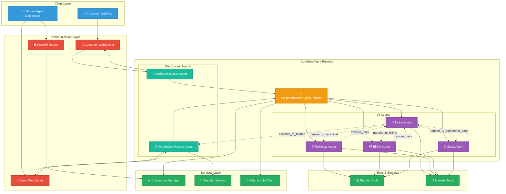
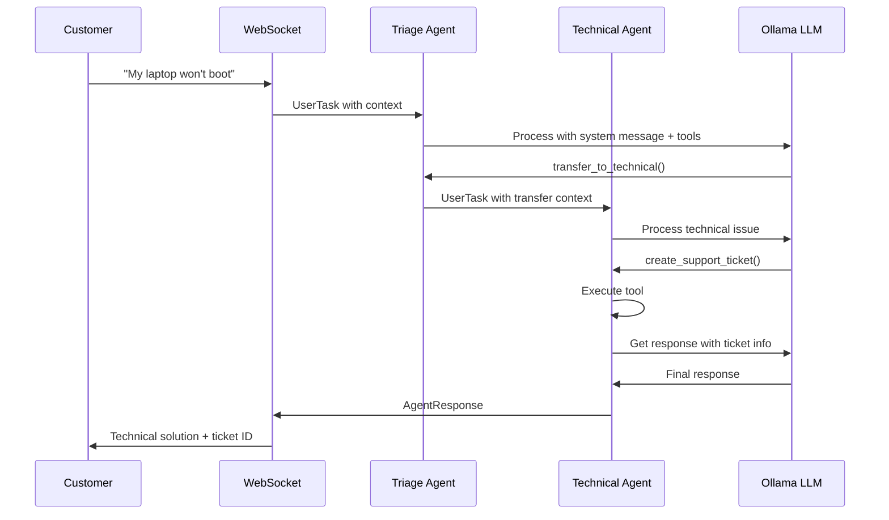
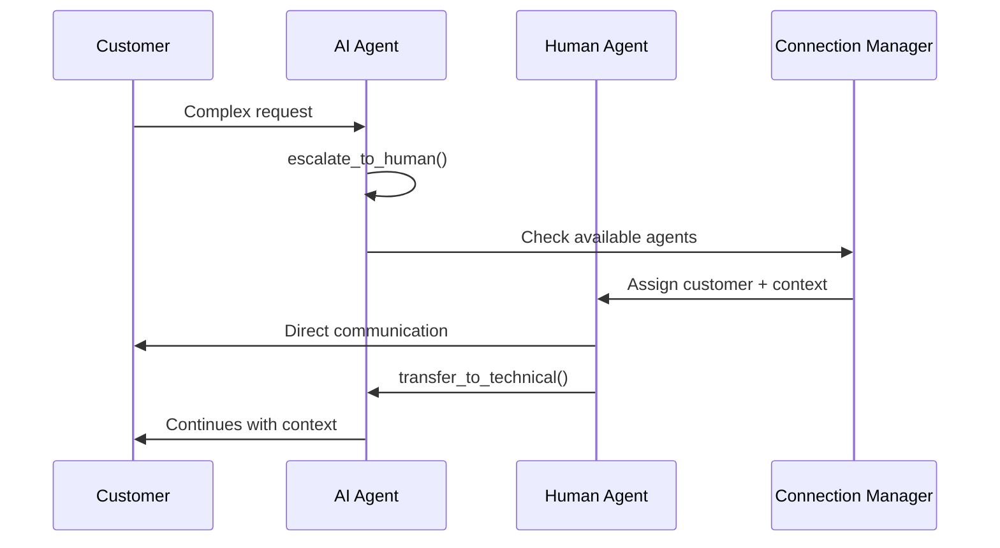

# 🤖 Multi-Agent Customer Support System

A sophisticated customer support system with AI agents, human agents, and seamless handoffs between them.

## 📁 Project Structure

```
autogen-project/
├── main.py                          # Main application entry point
├── requirements.txt                  # Python dependencies
├── README.md                        # This file
├── src/                             # Source code
│   ├── agents/                      # Agent implementations
│   │   ├── __init__.py
│   │   ├── ai_agent.py             # AI agent base class
│   │   ├── tools.py                # Function tools and delegate tools
│   │   └── websocket_agents.py     # WebSocket agents for human/user
│   ├── api/                         # API endpoints
│   │   ├── __init__.py
│   │   ├── routes.py               # REST API routes
│   │   └── websockets.py           # WebSocket endpoints
│   ├── models/                      # Data models
│   │   ├── __init__.py
│   │   └── message_models.py       # Pydantic models for messages
│   ├── services/                    # Business logic services
│   │   ├── __init__.py
│   │   ├── agent_runtime.py        # Agent runtime initialization
│   │   ├── connection_manager.py   # WebSocket connection management
│   │   └── transfer_service.py     # Human-to-AI transfer logic
│   └── utils/                       # Utility functions
│       ├── __init__.py
│       └── serialization.py        # Message serialization utilities
├── static/                          # Static files
│   ├── index.html                   # Customer chat interface
│   ├── agent_dashboard.html         # Human agent dashboard
│   ├── style.css                    # Stylesheets
│   └── script.js                    # Frontend JavaScript
└── autogen_env/                     # Virtual environment
```

## 🚀 Quick Start

1. **Install dependencies:**
   ```bash
   pip install -r requirements.txt
   ```

2. **Start the server:**
   ```bash
   python main.py
   ```

3. **Access the interfaces:**
   - Customer Chat: http://localhost:8000
   - Agent Dashboard: http://localhost:8000/agent-dashboard

## 🏗️ System Architecture



### Component Details

**🎯 Triage Agent**
- Routes customer requests to appropriate specialists
- Tools: Account lookup, transfer functions
- Handles initial customer contact and request routing

**🔧 Technical Support Agent** 
- Hardware, software, and system troubleshooting
- Tools: Ticket creation, system status checks
- Provides step-by-step solutions and escalation handling

**💳 Billing Support Agent**
- Payment, subscription, and billing inquiries  
- Tools: Account lookup, ticket creation
- Handles payment guidance and refund assistance

**🛒 Sales Support Agent**
- Product information and purchase assistance
- Tools: Account lookup
- Provides feature explanations and pricing information

**👤 Human Support Agent**
- Complex issue resolution and escalation handling
- Full system override with AI agent transfer capabilities
- Dedicated dashboard with real-time customer assignment

## Key Components

### 🎯 **Triage Agent**
- **Role**: Initial customer contact and request routing
- **Tools**: Account lookup, transfer functions
- **System Message**: Routes customers to appropriate specialists
- **Transfers To**: Technical, Billing, Sales, or Human agents

### 🔧 **Technical Support Agent**
- **Role**: Hardware, software, and system troubleshooting
- **Tools**: Ticket creation, system status checks
- **Capabilities**: Step-by-step solutions, escalation handling
- **Transfers**: Back to triage or human escalation

### 💳 **Billing Support Agent**
- **Role**: Payment, subscription, and billing inquiries
- **Tools**: Account lookup, ticket creation
- **Capabilities**: Payment guidance, refund assistance
- **Security**: Recommends human verification for sensitive data

### 🛒 **Sales Support Agent**
- **Role**: Product information and purchase assistance
- **Tools**: Account lookup
- **Capabilities**: Feature explanations, pricing information
- **Approach**: Helpful without being pushy

### 👤 **Human Support Agent**
- **Role**: Complex issue resolution and escalation handling
- **Capabilities**: Full system override, AI agent transfers
- **Tools**: Transfer back to any AI agent with context
- **Interface**: Dedicated dashboard with real-time customer assignment

## Message Flow Architecture

### Customer to AI Flow
```
Customer Input → WebSocket → Context Building → Triage Agent → LLM Processing → Tool/Transfer Decision → Response/Transfer
```

### AI Agent Processing


### Human Escalation Flow


## Technology Stack

- **Framework**: Microsoft AutoGen Core
- **LLM**: Ollama (llama3.1:latest)
- **Backend**: FastAPI + WebSockets
- **State Management**: In-memory with Connection Manager
- **Agent Types**: RoutedAgent with message handlers
- **Tools**: Function-based with JSON schema
- **Communication**: Real-time bidirectional WebSocket

## Key Features

- ✅ **Intelligent Routing**: Context-aware customer request routing
- ✅ **Stateful Conversations**: Full context preservation across transfers
- ✅ **Seamless Escalation**: Human agents can take over any conversation
- ✅ **Bidirectional Transfers**: Humans can transfer back to AI specialists
- ✅ **Real-time Communication**: WebSocket-based instant messaging
- ✅ **Agent Specialization**: Domain-specific tools and prompts
- ✅ **Error Handling**: Graceful degradation and retry mechanisms
- ✅ **Monitoring Dashboard**: Real-time system status and agent availability

## Agent Capabilities Matrix

| Agent Type | Account Lookup | Ticket Creation | Status Check | Transfer | Human Escalation |
|------------|---------------|----------------|--------------|----------|------------------|
| Triage     | ✅            | ❌             | ❌           | ✅       | ✅               |
| Technical  | ❌            | ✅             | ✅           | ✅       | ✅               |
| Billing    | ✅            | ✅             | ❌           | ✅       | ✅               |
| Sales      | ✅            | ❌             | ❌           | ✅       | ✅               |
| Human      | ✅            | ✅             | ✅           | ✅       | N/A              |
